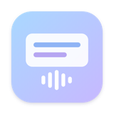
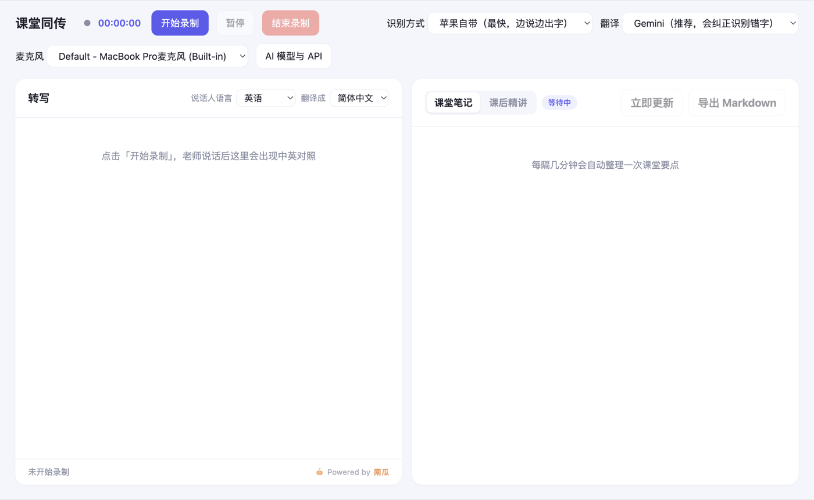

<p align="center"></p>

<h1 align="center">课堂同传</h1>

<p align="center">上课听不懂英文？课堂同传把老师说的话实时变成字幕，并翻译成中文；下课后自动整理成课后精讲。</p>

<p align="center"><b>预览版 v0.1.0</b> · 免费 · Powered by 南瓜</p>



## 能做什么

- **实时字幕**：老师边说边出字，说完一句马上出现正式字幕和中文翻译
- **翻得准**：AI 翻译会结合前几句话理解语境，语音识别听错的字也能按上下文纠正
- **电脑内部声音**：看网课、视频时，不用麦克风也能出字幕
- **课堂笔记**：上课过程中每隔几分钟自动整理一次要点
- **课后精讲**：下课后一键生成复习资料：带时间的章节大纲、讲解、术语表、思考题和核心要点，可以导出 PDF 或 Markdown
- **历史记录**：以前录过的课都能找回来，随时补生成课后精讲

## 支持哪些电脑

| 电脑 | 现在能不能用 |
|---|---|
| Mac，系统 macOS 26 或更新 | ✅ 全部功能都能用 |
| Mac，系统低于 macOS 26 | ⏳ 能打开，但语音识别要等下个版本 |
| Windows | ⏳ 下个版本 |

查看系统版本：点屏幕左上角的苹果图标 → 关于本机。

## 下载安装

1. 打开本页右侧的 **Releases**，下载最新版本的安装包：
   - 苹果芯片的 Mac（M1、M2、M3、M4……）：下载文件名里带 `arm64` 的 `.dmg`
   - Intel 芯片的 Mac：下载文件名里不带 `arm64` 的 `.dmg`
2. 双击打开下载好的 `.dmg`，把「课堂同传」拖进「应用程序」文件夹。
3. 在「应用程序」里双击打开「课堂同传」。

### 第一次打开被系统拦住怎么办

课堂同传暂时还没有苹果开发者签名，所以第一次打开时，系统会提示类似「无法验证开发者」或「Apple 无法检查其是否包含恶意软件」。这是正常的，按下面做一次就好：

1. 在提示框里点「完成」（不要点「移到废纸篓」）。
2. 打开「系统设置」→「隐私与安全性」，往下翻到「安全性」一栏。
3. 能看到「已阻止使用"课堂同传"」，点旁边的「仍要打开」，输入电脑密码确认。
4. 再打开一次课堂同传，在弹出的窗口里点「仍要打开」。

之后再打开就不会被拦了。

## 第一次使用

1. **隐私说明**：第一次打开会先告诉你哪些数据会上传、哪些不会，看完点「我知道了」。
2. **权限**：系统会询问能否使用「麦克风」和访问「文稿」文件夹，都点「允许」。用「电脑内部声音」时，还会询问能否「录制系统音频」，也点「允许」。
3. **填 Gemini key（可选，推荐）**：点右上角「AI 模型与 API」，粘贴 Gemini key 后点保存。不填也能用苹果自带的识别和翻译，但翻译不会结合上下文纠错，也不能生成课堂笔记和课后精讲。

### 怎么免费申请 Gemini key

1. 用浏览器打开 Google AI Studio，用你的 Google 账号登录。
2. 点「Get API key」，再点「Create API key」。
3. 复制生成的 key，粘贴到课堂同传的「AI 模型与 API」里，点保存。

Gemini 有免费额度，用完了会提示，第二天自动恢复，不会自动扣费（除非你自己开通了付费）。也可以填 Claude 的 key（按用量付费）。

## 隐私

| 功能 | 数据去向 |
|---|---|
| 苹果自带识别、苹果自带翻译 | 只在你的电脑上处理，不上传 |
| Gemini 翻译、课堂笔记、课后精讲 | 转写的文字会发送给 Google |
| Claude 翻译、课堂笔记、课后精讲 | 转写的文字会发送给 Anthropic |
| 作者 | 收不到任何数据：App 里没有统计、没有上传，作者也没有服务器 |

- 课堂记录和课后精讲保存在「文稿/课堂同传」文件夹里，可以随时删除。
- API key 用系统加密保存在你的电脑上，界面上只显示最后 4 位。

> **课堂录音前，请先确认学校和老师的规定。**

## 常见问题

**翻译显示「免费额度用完了」？**
Gemini 每个模型每天都有免费次数，用完后第二天自动恢复。这期间如果是新 Mac，会自动改用苹果自带翻译顶上。

**苹果自带翻译提示「还没下载这对语言」？**
在「AI 模型与 API」里点「打开系统设置下载语言」，在「翻译语言」里下载英语和中文（简体）。

**选了「电脑内部声音」却没有字幕？**
到「系统设置」→「隐私与安全性」→「录屏与系统录音」里，确认已经允许「课堂同传」。

**录过的课在哪里？**
在「文稿/课堂同传」文件夹里。也可以在 App 右侧「课后精讲」标签里，从课程列表中选择以前的课。

## 给开发者

项目包含两部分：

- `desktop/`：桌面版 App（Electron）。需要 Node.js 22 和 macOS 上的 Swift 命令行工具。
  ```bash
  cd desktop
  npm install
  npm test        # 运行测试
  npm start       # 开发模式运行
  npm run dist    # 打包 Mac 安装包（含打包后安全检查）
  ```
- 根目录：最初的网页版（Python + 浏览器），保留做参考。

设计文档和开发计划在 `docs/superpowers/` 里。

## 许可证

[MIT](LICENSE) · Powered by 南瓜
