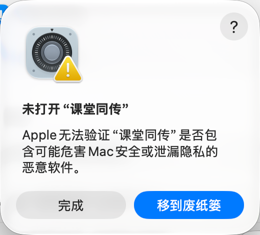
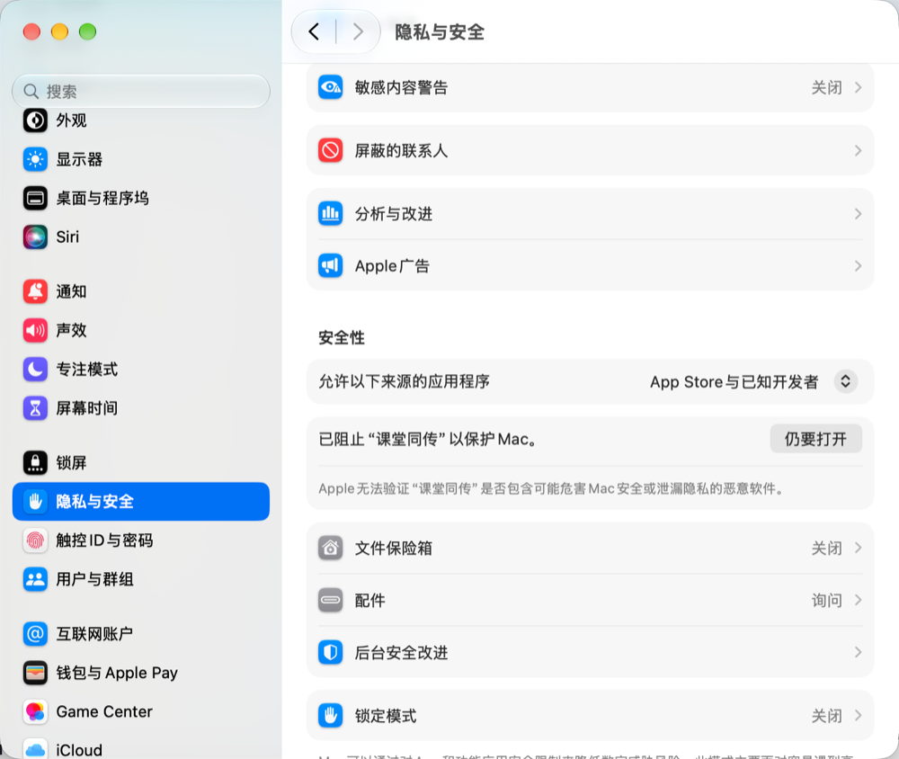

<p align="center"></p>

<h1 align="center">课堂同传</h1>

<p align="center">上课听不懂英文？课堂同传把老师说的话实时变成字幕，并翻译成中文；下课后自动整理成课后精讲。</p>

<p align="center"><b>预览版 v0.5.0</b> · 免费 · Powered by 南瓜</p>

<p align="center"><a href="../../releases/latest"><b>下载最新版</b></a></p>


## 能做什么

- **实时字幕**：老师边说边出字，说完一句马上定稿并翻译成中文。英语课在所有电脑上都不用填 key 就能出字幕
- **翻得准**：AI 翻译会结合前几句话理解语境，语音识别听错的字也能按上下文纠正
- **电脑内部声音**：看网课、视频时，不用麦克风也能出字幕
- **课堂笔记**：上课过程中每隔几分钟自动整理一次要点
- **课后精讲**：下课后一键生成复习资料：带时间的章节大纲、讲解、术语表、思考题和核心要点，可以导出 PDF 或 Markdown
- **回听原声**：打开「保存录音」后，点字幕或课后精讲里的时间，就能从那一句开始回听老师的原话；录音只存在自己电脑上，到期自动清理；点「查看录音」可以看到所有录音，直接播放或删除
- **更新提醒**：有新版时 App 右下角会提示，点一下打开下载页，下载新的安装包装一遍即可
- **历史记录**：以前录过的课都能找回来，随时补生成课后精讲

## 支持哪些电脑

| 电脑 | 语音识别 | 能不能录电脑内部声音 |
|---|---|---|
| Mac，系统 macOS 26 或更新 | 苹果自带、本地实时或云端 Gemini | 可以 |
| Mac，系统 macOS 14.2 到 macOS 26 之前 | 本地实时（英语）或云端 Gemini | 可以 |
| Mac，系统更旧 | 本地实时（英语）或云端 Gemini | 不可以 |
| Windows 10 / 11 | 本地实时（英语）或云端 Gemini | 可以 |

三种识别方式的区别：

| 识别方式 | 特点 |
|---|---|
| 苹果自带 | 只有新 Mac 能用。免费，边说边出字，在电脑上处理 |
| 本地实时 | 所有电脑都能用。免费，不用填 key，边说边出字，在电脑上处理；目前只支持英语 |
| 云端（Gemini） | 需要填 Gemini key。一句一句出，慢一些，但支持更多语言，也能同时识别中文和英文 |

查看 Mac 系统版本：点屏幕左上角的苹果图标 → 关于本机。

## 下载安装

1. 点本页最上面的 **「下载最新版」**（或者本页右侧 Releases 下的「课堂同传 v0.5.0 预览版」），在打开页面最下面的 **Assets** 里下载安装包：
   - 苹果芯片的 Mac（M1、M2、M3、M4……）：下载 **「课堂同传 0.5.0 Mac（苹果芯片 M1–M4）」**
   - Intel 芯片的 Mac：下载 **「课堂同传 0.5.0 Mac（Intel 芯片）」**
   - 大多数 Windows 电脑：下载 **「课堂同传 0.5.0 Windows（大多数电脑）」**
   - ARM 芯片的 Windows 电脑（比如部分 Surface、骁龙笔记本）：下载 **「课堂同传 0.5.0 Windows（ARM 芯片）」**

   不知道 Mac 是哪种芯片？点屏幕左上角的苹果图标 →「关于本机」，看「芯片」那一行。注意不要点绿色的「Code → Download ZIP」，那是源代码，不是软件。
2. Mac：双击打开下载好的 `.dmg`，把「课堂同传」拖进「应用程序」文件夹，然后在「应用程序」里双击打开。
3. Windows：双击下载好的 `setup.exe`，按安装向导一路「下一步」，装好后在开始菜单里找「课堂同传」。

### 第一次打开被系统拦住怎么办

课堂同传暂时还没有苹果开发者签名，所以第一次打开时，系统会弹出「未打开"课堂同传"」，说 Apple 无法验证它是否包含恶意软件。这是正常的，按下面做一次就好：

1. 在弹窗里点 **「完成」**（不要点「移到废纸篓」）。

   

2. 打开 **「系统设置」→「隐私与安全」**，往下翻到 **「安全性」** 一栏，能看到「已阻止"课堂同传"以保护 Mac」，点旁边的 **「仍要打开」**，输入电脑密码确认。

   

3. 再打开一次课堂同传，如果弹出确认窗口，点「仍要打开」。

之后再打开就不会被拦了。

### Windows 安装时提示「Windows 已保护你的电脑」

课堂同传暂时没有微软的代码签名，第一次运行安装程序时可能会出现这个提示：

1. 点提示里的「更多信息」。
2. 点出现的「仍要运行」，然后按安装向导一路「下一步」。

## 第一次使用

1. **隐私说明**：第一次打开会先告诉你哪些数据会上传、哪些不会，看完点「我知道了」。
2. **权限**：系统会询问能否使用「麦克风」和访问「文稿」文件夹，都点「允许」。用「电脑内部声音」时，还会询问能否「录制系统音频」，也点「允许」。
3. **填 Gemini key（推荐）**：点右上角「AI 模型与 API」，粘贴 Gemini key 后点保存。不填也能看到英文字幕；填了才有结合上下文的中文翻译、课堂笔记和课后精讲。新 Mac 不填 key 时可以用苹果自带翻译。

### 怎么免费申请 Gemini key

1. 用浏览器打开 Google AI Studio，用你的 Google 账号登录。
2. 点「Get API key」，再点「Create API key」。
3. 复制生成的 key，粘贴到课堂同传的「AI 模型与 API」里，点保存。

Gemini 有免费额度，用完了会提示，第二天自动恢复，不会自动扣费（除非你自己开通了付费）。也可以填 Claude 的 key（按用量付费）。

## 隐私

| 功能 | 数据去向 |
|---|---|
| 苹果自带识别、苹果自带翻译 | 只在你的电脑上处理，不上传 |
| 本地实时识别 | 只在你的电脑上处理，不上传 |
| 保存录音（默认关闭） | 只存在你电脑的课堂记录文件夹里，不上传；默认 7 天后自动删除，可以改 |
| 云端识别（Gemini） | 有人说话的音频片段会发送给 Google |
| Gemini 翻译、课堂笔记、课后精讲 | 转写的文字会发送给 Google |
| Claude 翻译、课堂笔记、课后精讲 | 转写的文字会发送给 Anthropic |
| 检查更新 | 打开 App 时向 GitHub 查询最新版本号，不发送任何个人信息 |
| 作者 | 收不到任何数据：App 里没有统计、没有上传，作者也没有服务器 |

- 课堂记录和课后精讲保存在「文稿/课堂同传」文件夹里（Windows 上是「文档\课堂同传」），可以随时删除。
- API key 用系统加密保存在你的电脑上，界面上只显示最后 4 位。

> **课堂录音前，请先确认学校和老师的规定。**

## 常见问题

**翻译显示「免费额度用完了」？**
Gemini 每个模型每天都有免费次数，用完后第二天自动恢复。这期间如果是新 Mac，会自动改用苹果自带翻译顶上。

**苹果自带翻译提示「还没下载这对语言」？**
在「AI 模型与 API」里点「打开系统设置下载语言」，在「翻译语言」里下载英语和中文（简体）。

**选了「电脑内部声音」却没有字幕？**
到「系统设置」→「隐私与安全」→「录屏与系统录音」里，确认已经允许「课堂同传」。

**Windows 上麦克风列表是空的？**
到「设置 → 隐私和安全性 → 麦克风」，打开「麦克风访问权限」和「允许桌面应用访问麦克风」，然后重新打开课堂同传。

**录音占多少空间？会一直留着吗？**
「保存录音」默认是关的。打开后，一节 90 分钟的课大约占 170 MB，和课堂记录放在同一个文件夹里（`.wav` 文件）。默认 7 天后自动删除，可以在「自动清理」里改成 3 天、30 天或不清理；课堂记录和课后精讲不会被清理。

**怎么更新到新版？**
有新版时 App 右下角会出现提示，点它打开下载页，下载新的安装包再装一遍就行，课堂记录和设置都会保留。Mac 上装完第一次打开，可能要按上面的步骤再点一次「仍要打开」；如果弹出「想要使用钥匙串中的机密信息」，这是系统在确认新版能不能读取你保存的 key，输入电脑的登录密码并点「始终允许」即可。

**录过的课在哪里？**
在「文稿/课堂同传」文件夹里（Windows 上是「文档\课堂同传」）。也可以在 App 右侧「课后精讲」标签里，从课程列表中选择以前的课。

## 给开发者

项目包含两部分：

- `desktop/`：桌面版 App（Electron）。需要 Node.js 22 和 macOS 上的 Swift 命令行工具。
  ```bash
  cd desktop
  npm install
  npm test        # 运行测试
  npm run models  # 下载本地实时识别模型（需要 GitHub 命令行工具 gh）
  npm start       # 开发模式运行
  npm run dist    # 打包 Mac 安装包（含打包后安全检查）
  npm run dist:win  # 打包 Windows 安装程序（苹果芯片 Mac 需要先装 Rosetta）
  ```
- 根目录：最初的网页版（Python + 浏览器），保留做参考。

设计文档和开发计划在 `docs/superpowers/` 里。

## 许可证

[MIT](LICENSE) · Powered by 南瓜

安装包里包含的第三方组件和模型（sherpa-onnx、Kroko ASR 英语社区模型、Silero VAD 等）及其许可证见 `desktop/assets/THIRD_PARTY_NOTICES.md`。其中本地实时识别使用的 Kroko 社区模型以 CC-BY-SA 协议提供，由 Banafo 发布，课堂同传未作修改。
